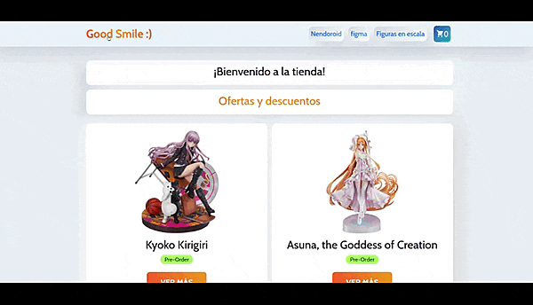

# E-commerce Good Smile 🙂

Desarrollado para el curso de React JavaScript de CoderHouse.

### Caracteristicas

- El usuario puede mirar todas las figuras disponibles o filtrar según la categoria que le interese ('nendoroid', 'figma', o 'figura en escala').
- Se puede seleccionar la cantidad de unidades que se quiere agregar al carrito en la pagina de detalle de cada figura.
- En el carro el usuario tambien puede volver a modificar las cantidades, eliminar un item o vaciar por completo el carrito.
- Existe una pagina de checkout donde se solicita al usuario que rellene un formulario con sus datos personales para confirmar la orden.
- Los datos de las figuras y las ordenes realizadas se almacenan en una base de datos provista por la plataforma de Firebase.
- Popup con información de promociones y ofertas.
- Las categorias incluidas en el NavBar son dinámicas, donde el menú se renderiza en base a una colección de Firebase.
